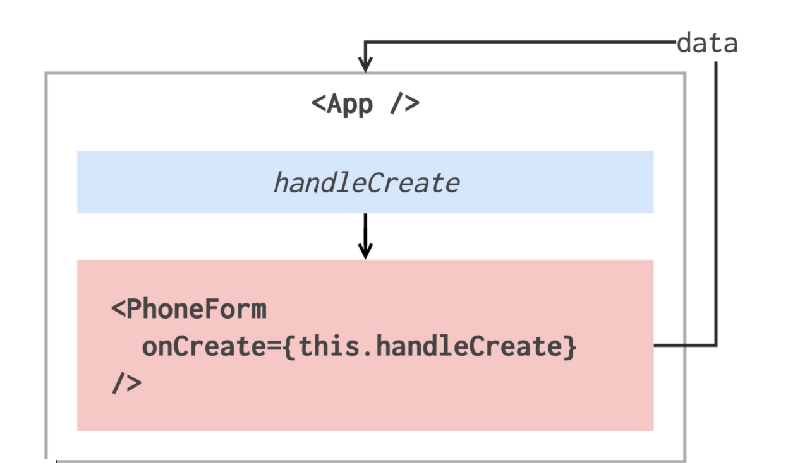

[TOC]


### 프론트엔드 라이브러리란?

뭐고, 왜 필요할까?

요즘 웹은 **웹 애플리케이션**이다

브라우저 상으로도 자연스러운 흐름으로도 (동적으로) 모든 것을 할 수 있다.

생산성과 관여되어있음

높은 유지보수성

그래서 angular react vue가 존재


Angular 

- 다양한 기능을 내장하고 있음
- http client 다국어 지원 등


React

- component에 집중되어있음

- 데이터를 조립해서 보여준다


Vue.js

- 쉽다
- 모듈 번들러가 없어도 cdn을 불러와서 쓰는 형태도 가능
- html을 template를 그대로 사용할 수도 있다
- 공식문서가 잘 되어있다
- Directive.. etc


"우리는 지속해서 데이터가 변화하는 대규모 애플리케이션을 구축하기 위해 리액트를 만들었습니다."

Model

양방향 바인딩

변화(Mutation): 모델의 값이 변하면 뷰에서의 값도 변하고, 뷰에서 값이 변하면 모델의 값도 변한다.

데이터가 바뀌면 기존 뷰를 날리고 새로 만들어버리면 어떨까?라는 생각으로 시작된 react개발


그래서 Virtual DOM이 존재

Virtual DOM에 랜더링하고 (바뀐 부분만) 정말 변화가 필요한 기존의 DOM만 업데이트


[React 와 Virtual DOM 의 이야기](https://youtu.be/muc2ZF0QIO4)


view - react

변화에 해당하는 것만 다시 그린다


### 리액트를 특별하게 만드는 점

virtual DOM


### **리액트 프로젝트 시작하기**

webpack 

- 코드 의존하는 순서대로 여러개의 파일로 생성함

- 번들링 작업을 하게될때 특정 확장자 마다 처리작업을 하도록 준비를 해준다
- 이미지 압축 후 특정 경로에 특정 확장자로 저장 할 수 있도록 한다

- 전체 파일 도구


babel

- 자바스크립트 변환 도구
- 자바스크립트는 계속 변화되는중이라서 변환도구가 필요해진다.


https://codesandbox.io/s/4r6lqrlvj9


### **JSX** 기본문법

https://developer.mozilla.org/ko/docs/Web/JavaScript/Reference/Statements/const


html이랑 비슷하지만 지켜야할 규칙이 있다.


:one: 태그는 </div> 처럼 닫혀 있어야 한다.

- <input type="text"/> 처럼


:two: 두개 이상의 엘레먼트는 무조건 하나의 엘리먼트로 감싸져 있어야 한다

```js
// error
class App extends Component {
  render() {
    // 메소드
    return (
      // JSX형태를 꼭 리턴해줘야 한다.
      <div>
        <h1>안녕하세요 리액트</h1>
      </div>
      <div>
        <h1>안녕하세요 리액트</h1>
      </div>
    );
  }
}
      
```

```javascript
// 아래와 같이 하나의 element로 감싸줘야 한다.
class App extends Component {
  render() {
    // 메소드
    return (
      // JSX형태를 꼭 리턴해줘야 한다.
      <div>
      <div>
        <h1>안녕하세요 리액트</h1>
      </div>
      <div>
        <h1>안녕하세요 리액트</h1>
      </div>
      </div>

    );
  }
}
```

extra div태그가 생기므로

:star: 또는 Fragement를 불러와서 사용하면 된다.

```python
// react모듈을 사용하겠다는 것
// 반드시 먼저 선언해야 한다.
import React, { Component, Fragment } from 'react';

class App extends Component {
  render() {
    // 메소드
    return (
      // JSX형태를 꼭 리턴해줘야 한다.
    <Fragment>
      <div>
        <h1>안녕하세요 리액트</h1>
      </div>
      <div>
        <h1>안녕하세요 리액트</h1>
      </div>
    </Fragment>
    );
  }
}

export default App;

```


:three: JSX 안에 자바스크립트 값 사용하기

```js
import React, { Component } from 'react';

class App extends Component {
  render() {
    const name = 'react';
    return (
      <div>
        hello {name}!
      </div>
    );
  }
}

export default App;
```


var 은 scope 가 함수단위인데요:

```javascript
function foo() {
  var a = 'hello';
  if (true) {
    var a = 'bye';
    console.log(a); // bye
  }
  console.log(a); // bye
}
```


반면 const 와 let 은 scope 가 블록 단위 입니다.

```javascript
function foo() {
  let a = 'hello';
  if (true) {
    let a = 'bye';
    console.log(a); // bye
  }
  console.log(a); // hello
}
```


var 을 쓸 일이 없다. 

값을 선언 후 바꿔야 할 땐 let, 

바꾸지 않을 땐 const 사용


:four: 조건부 렌더링

JSX 내부에서 조건부 렌더링을 할 때는 보통 삼항 연산자를 사용하거나, AND 연산자를 사용합니다.

반면에 if 문을 사용 할 수는 없어요 (사용하려면 [IIFE](https://developer.mozilla.org/ko/docs/Glossary/IIFE)(즉시 실행 함수 표현) 을 사용해아합니다.)

```js
import React, { Component } from 'react';

class App extends Component {
  render() {
    return (
      <div>
        {
          1 + 1 === 2 
            ? (<div>맞아요!</div>)
            : (<div>틀려요!</div>)
        }
      </div>
    );
  }
}

export default App;
```


삼항연산자

&& 

```js
// react모듈을 사용하겠다는 것
// 반드시 먼저 선언해야 한다.
import React, { Component, Fragment } from 'react';

class App extends Component {
  render() {
    // 메소드
    const name = 'velopert!';
    return (
      // JSX형태를 꼭 리턴해줘야 한다.
      <div>
        {
          name === 'velopert!' && <div>벨로퍼트다!</div>
        }
      </div>
    );
  }
}

export default App;
```


function은  ()으로 감싸줘야 한다.

```js
// react모듈을 사용하겠다는 것
// 반드시 먼저 선언해야 한다.
import React, { Component, Fragment } from 'react';

class App extends Component {
  render() {
    // 메소드
    const value = 1;
    return (
      // JSX형태를 꼭 리턴해줘야 한다.
      <div>
        {
          (function() {
            if (value === 1) return <div>1이다!</div>
          })()
        }
      </div>
    );
  }
}

export default App;


/* 함수형은 둘 다 가능

(function() {
	// logic
	return // ans
}) ()

(() => {
	// logic
	return // ans
}) ()
*/


/*

(() => {
  if (value === 1) return (<div>하나</div>);
  if (value === 2) return (<div>둘</div>);
  if (value === 3) return (<div>셋</div>);
})()

*/
```


:five: style 과 className

style

스타일은 **객체 형태**로 넣어진다

```js
// react모듈을 사용하겠다는 것
// 반드시 먼저 선언해야 한다.
import React, { Component } from 'react';

class App extends Component {
  render() {
    const style = {
      backgroundColor: 'black',
      color: 'white',
      padding: '16px',
      fontSize: '36px',
    };
    return (
    <div style={style}>안녕하세요!</div>
    )
  }
}

export default App;

```


className으로 style을 적용할 수 있는데,

app.css 파일을 생성 후 

```css
.App {
  color: aqua;
}
```

```js
// react모듈을 사용하겠다는 것
// 반드시 먼저 선언해야 한다.
import React, { Component } from 'react';
import './app.css'

class App extends Component {
  render() {
    return (
    <div className="App">안녕하세요!</div>
    ) // 이와 같이 className으로 속성을 추가해준다.
  }
}

export default App;
```


:six: element안에서 주석 다는 방법

```js
import React, { Component } from 'react';

class App extends Component {
  render() {
    return (
      <div>
        {/* 주석은 이렇게 */}
        <h1
          // 태그 사이에
        >리액트</h1>
      </div>
    );
  }
}

export default App;
```


### Props 를 사용하는 방법

props와 state


**props란**

부모컴포넌트가 자식컴포넌트에게 값을 전달할 때 사용된다.

component를 만들때 전달한다

- 부모가 자식에게 값을 넘겨준다.
- 읽기전용

MyName.js 생성 후

```js
import React, { Component } from 'react';

class MyName extends Component {
  static defaultProps = { // 이걸 설정하면 부모컴포넌트에서 값이 들어오지 않을때 기본이름이 대신 보인다.
    name: '기본이름'
  }
  render() {
    return (
      <div>
        안녕하세요! 제 이름은 <b>{this.props.name}</b> 입니다.
      </div>
    );
  }
}

// 아래와 같이 기본이름을 설정하는 방법도 있다.
// MyName.defaultProps = {
//   name: "기본이름",
// }


export default MyName;
```


그리고 다시 App.js로 돌아가서

```js
import React, { Component, Fragment } from 'react';
import MyName from './MyName'; // 자식을 등록해주고,

class App extends Component {
  render() {
    return (
      <Fragment>
        <MyName name="리액트" /> // 자식한테 이와 같이 값을 전달해준다.
        <div>
          <h1>안녕하세요 리액트</h1>
        </div>
      </Fragment>
    );
  }
}

export default App;
```


함수형컴포넌트

props만 받아와서 보여주는 경우에는 함수형컴포넌트로 작성한다.

함수형컴포넌트가 더 빨라서 자주 사용하는 편이다.

```js
import React from 'react'; // 함수형은 Component를 불러오지 않아도 된다. 하지만 React는 계속 유지해줘야 한다.

// 비구조화 할당 문법
const MyName = ({ name }) => {
  return <div>안녕하세요 제 이름은 {name} 입니다!</div>;
};

MyName.defaultProps = {
  name: 'velopert'
};
export default MyName;
```


### State 를 사용하는 방법

- 컴포넌트 내부가 가진 값을 변경할 수 있다.
- 값을 변경할 수도 있다.

state는 내부에서 변경 할 수 있다

변경 할 때는 언제나 setState라는 함수를 사용한다


Counter.js

```js
import React, { Component } from 'react';

class Counter extends Component {
  // 객체여야 한다
  state = {
    number: 0
  };

  handleIncrease = () => { // 반드시 화살표로 해야만 this가 뭔지 알게 된다.
    this.setState({
      number: this.state.number + 1
    });
  };

  handleDecrease = () => {
    this.setState({
      number: this.state.number - 1
    });
  };

  render() {
    return (
      <div>
        <h1>counter</h1>
        <div>value: {this.state.number}</div>
        <button onClick={this.handleIncrease}>+</button>
        <button onClick={this.handleDecrease}>-</button>
      </div>
    );
  }
}

export default Counter;

```


App.js에 컴포넌트를 불러온다

```js
import React, { Component, Fragment } from 'react';
import Counter from './Counter';

class App extends Component {
  render() {
    return <Counter />;
  }
}

export default App;
```


### LifeCycle API 소개 및 사용법 1

- 생명주기
- 1. 나타날 때 2. 업데이트 될 때 3. 사라질 때


`마운팅`

- 컴포넌트가 브라우저 상에 나타날 때

`업데이팅`

- 컴포넌트나 스테이트가 바뀔때

`언마운팅`

- 브라우저상에서 사라질 때

`getDerivedStateFromProps()`

- props의 값을 state에 저장하고 싶은 경우 사용한다

`render()`

- 어떤 돔을 만들지, 등을 정의하는 곳

`componentDidMount`

- 특정 돔에 차트를 그려주세요 같은 코드
- ajax 요청
- 컴포넌트가 나타나고 몇초후에 작업을 하고 싶은 경우
- 이벤트리스닝
- api요청

`shouldComponentUpdate`

- component가 업데이트 되는 성능을 최적화 하고 싶은 경우

- true를 반환하면 rendering을 거치고
- false면 rendering이 되지 않아서 브라우저에 보이지 않는다
- virtual Dom에 render할지 말지 결정하는 함수이다

`getSnapshotBeforeUpdate`

- 브라우저상에 반영되기 바로 직전에 호출되는 함수
- 랜더링을 하고 업데이트를 바로 하기 전에 스크롤위치, 해당 돔의 크기를 가져오고 싶을때 사용

`componentDidUpdate`

- 작업을 마치고 업데이트가 되었을때
- 스테이트가 바뀐 경우 이전의 상태와 지금의 상태랑 다르면서 어떤 이벤트가 일어나게 하고 싶을때 하는 것

`componentWillUnmount`

- 컴포넌트가 사라지게 하는  함수
- 설정한 리스너를 없애주는 것


### LifeCycle API 소개 및 사용법 2

App.js

```js
import React, { Component } from 'react';
import MyComponent from './MyComponent';

class App extends Component {
  state = {
    counter: 1,
    error: false
  };

  componentDidCatch(error, info) {
    this.setState({
      error: true
    });
    // API를 통해서 서버로 오류 내용 날리기
    // console.log(error); // 어떤 error?
    // console.log(info); // error가 어디서?
  }

  constructor(props) {
    // props를 prams로 받아온다
    super(props);
    console.log('constructor');
  }

  componentDidMount() {
    // 외부 라이브러리 연동: D3, masonry, etc
    // 컴포넌트에서 필요한 데이터 요청: Ajax, GraphQL, etc
    // DOM 에 관련된 작업: 스크롤 설정, 크기 읽어오기 등
    console.log('componentDidMount');
    // 특정 돔의 크기가 실제 몇인지 등등의 상세 정보를 알 수 있다.
    console.log(this.myDiv.getBoundingClientRect().height);
  }

  handleClick = () => {
    this.setState({
      counter: this.state.counter + 1
    });
  };

  render() {
    // ref를 사용하면 위에서 this.myDiv식으로 해서 정보를 가지고 올 수 있다.
    // componentWillUnmount를 사용한 게 시작되는 부분은 아래와 같다.
    // 아래의 조건에 따라 componentWillUnmount의 실행 여부가 결정 된다.
    // { this.state.counter <10 && <MyComponent value={this.state.counter} />}
    if (this.state.error) {
      return <div>에러가 발생했습니다.</div>;
    } else {
      return (
        <div ref={ref => (this.myDiv = ref)}>
          <h1>안녕하세요.</h1>
          {this.state.counter < 10 && (
            <MyComponent value={this.state.counter} />
          )}
          <button onClick={this.handleClick}>Click Me</button>
        </div>
      );
    }
  }
}

export default App;

```


MyComponent.js

```js
import React, { Component } from 'react';

class MyComponent extends Component {
  state = {
    value: 0
  };

  // static 값으로 넣어줘야 한다
  // nextProps 다음으로 받아올 값
  // prevState 업데이트 되기전 값
  static getDerivedStateFromProps(nextProps, prevState) {
    if (prevState.value !== nextProps.value) {
      return {
        value: nextProps.value
      };
    }
    // 값이 동일한 경우 null 처리를 해준다.
    return null;
  }

  // nextProps
  // nextState

  // 특정조건에 따라 랜더링을 막아줄 수 있는 함수
  shouldComponentUpdate(nextProps, nextState) {
    // false 하면 랜더링을 안해서 업데이트가 안된다.
    if (nextProps.value === 10) return false;

    // nextProps.value !== 10 그렇지 않으면 업데이트를 한다.
    return true;
  }

  // 값이 바뀌면 확인할 수 있다.
  componentDidUpdate(prevProps, prevState) {
    if (this.props.value !== prevProps.value) {
      console.log('value 값이 바뀌었다!', this.props.value);
    }
  }

  // 컴포넌트가 불필요해지는 경우 사라지도록 한다.
  // 부모컴포넌트에서 작동하도록 할 수 있다.
  componentWillUnmount() {
    console.log('Good Bye');
  }

  render() {
    return (
      <div>
        {/* {this.props.missing.something} */}
        {/* {this.props.missing.something} 에러가 난다. 왜냐하면 없는 값이기 때문에 
        이런 경우를 처리하기 위해 에러가 발생할 수 있는 부모컴포넌트에서 처리를 해야 한다.*/}
        <p>props: {this.props.value}</p>
        <p>state: {this.state.value}</p>
      </div>
    );
  }
}

export default MyComponent;

```


### static getDerivedStateFromProps()

이 함수는, v16.3 이후에 만들어진 라이프사이클 API 인데요, 이 API 는 props 로 받아온 값을 state 로 동기화 하는 작업을 해줘야 하는 경우에 사용됩니다.

```javascript
static getDerivedStateFromProps(nextProps, prevState) {
  // 여기서는 setState 를 하는 것이 아니라
  // 특정 props 가 바뀔 때 설정하고 설정하고 싶은 state 값을 리턴하는 형태로
  // 사용됩니다.
  /*
  if (nextProps.value !== prevState.value) {
    return { value: nextProps.value };
  }
  return null; // null 을 리턴하면 따로 업데이트 할 것은 없다라는 의미
  */
}
```


### getSnapshotBeforeUpdate()

업데이트 직전의 스크롤 위치를 유지해서 사용자가 보는 위치가 유지되도록 하는 함수

이 API 가 발생하는 시점은 다음과 같습니다.

1. render()
2. **getSnapshotBeforeUpdate()**
3. 실제 DOM 에 변화 발생
4. componentDidUpdate

이 API를 통해서, DOM 변화가 일어나기 직전의 DOM 상태를 가져오고, 여기서 리턴하는 값은 componentDidUpdate 에서 3번째 파라미터로 받아올 수 있게 됩니다.

예시코드:

```javascript
  getSnapshotBeforeUpdate(prevProps, prevState) {
    // DOM 업데이트가 일어나기 직전의 시점입니다.
    // 새 데이터가 상단에 추가되어도 스크롤바를 유지해보겠습니다.
    // scrollHeight 는 전 후를 비교해서 스크롤 위치를 설정하기 위함이고,
    // scrollTop 은, 이 기능이 크롬에 이미 구현이 되어있는데, 
    // 이미 구현이 되어있다면 처리하지 않도록 하기 위함입니다.
    if (prevState.array !== this.state.array) {
      const {
        scrollTop, scrollHeight
      } = this.list;

      // 여기서 반환 하는 값은 componentDidMount 에서 snapshot 값으로 받아올 수 있습니다.
      return {
        scrollTop, scrollHeight
      };
    }
  }

  componentDidUpdate(prevProps, prevState, snapshot) {
    if (snapshot) {
      const { scrollTop } = this.list;
      if (scrollTop !== snapshot.scrollTop) return; // 기능이 이미 구현되어있다면 처리하지 않습니다.
      const diff = this.list.scrollHeight - snapshot.scrollHeight;
      this.list.scrollTop += diff;
    }
  }
```

전체코드는 https://codesandbox.io/s/484zvr87ow 에서 확인 하실 수 있습니다.


### **리액트 작업환경 직접 설정하기**

MacOS에서 

- nvm으로 설치
  - https://gist.github.com/falsy/8aa42ae311a9adb50e2ca7d8702c9af1
- nvm install --lts 설치
- node는 v8이상이여야 한다.

```bash
$ node -v
v12.14.1
```


- npm 이 설치된다. 버전관리 등에 사용되는 도구
- yarn도 똑같음 yarn 사용 권장 (더 빠르다)

```bash
$ brew install yarn

$ brew install yarn --without-node

$ yarn -v
1.21.1
```


- webpack, webpack-dev-server, babel 설치

```bash
$ npm install -g babel webpack webpack-dev-server
```


- 리액트 home 프로젝트 생성

```bash
$ create-react-app home
```


- 프로젝트 시작

```bash
$ yarn start
```


설정을 customizing을 해야하는 경우

terminal에서 

yarn eject

-> y

해서 config파일이 앱에 생긴것을 확인 할 수  있음


### Input 상태 관리하기


Component directory를 만들어서 안에 작업하면된다.

extensions에 Reactjs code snippets을 다운받으면 자동완성이 쉬움

rcc -> 클래스형태의 컴포넌트

rsc -> 함수형태의 컴포넌트 


깔고나면 그냥 app.js 에서 자식 컴포넌트를 불러오는걸 div안에서 사용할때

맨위에서 자동으로 import해줘서 매우 편리 


자식 컴포넌트에서

input같은 경우 state의 기본값이 될 것을 설정해주고

setState를 해주고

render하는 걸 해주고


```js
import React, { Component } from 'react';

class PhoneForm extends Component {
    state = {
        name: '',
        phone: '',
    }
    // handlechange 에 e 라는 event객체를 input의 객체로서 받는다.
    // 값은 e.target.value로 꺼낸다
		// [e.target.name] :  새로들어오는 값
		// 을 하여 각 state 의 값을 바꿔준다.
    handleChange = (e) => {
        this.setState({
            [e.target.name]: e.target.value,
            [e.target.phone]: e.target.value
        })
    };

    render() {
        return (
            <form>
          			// 이를 위해서 name을 정해줘야 한다.
                <input 
                name="name"
                placeholder="name" 
                onChange={this.handleChange} 
                value={this.state.name} />
                <input 
                name="phone"
                placeholder="phone number" 
                onChange={this.handleChange} 
                value={this.state.phone} />
                <div>
                    <p>{this.state.name}</p>
                    <p>{this.state.phone}</p>
                </div>
            </form>
        );
    }
}

export default PhoneForm;
```


### 배열에 데이터 삽입하기

자식컴포넌트가 부모한테 값 전달하기





App.js

```js
import React, { Component } from 'react';
import PhoneForm from './components/PhoneForm';


class App extends Component {
  id = 0;

  // 배열 다루기
  // 리액트에서는 불변성을 반드시 유지해야한다
  // 어떤 값을 수정해야할때 setState를 반드시 사용
  // 내부의 배열이나 객체를 바꿀 경우에는 기존 배열을 수정하지 않고
  // 그걸 기반으로 새로 배열이나 객체를 만들어서 바꿔야 한다.
  // **concat**을 사용하여 기존에 있는건을 수정하지 않고 새로운 배열을 만든다
  state = {
    information: [],
  }

  handleCreate = (data) => {
    // 비구조 할당 문법
    const { information } = this.state;
    console.log(data);

    this.setState({
      // 세번째 방법
      // Object.assign() 메소드는 열거할 수 있는 하나 이상의 출처 객체로부터 대상 객체로 속성을 복사할 때 사용합니다. 대상 객체를 반환합니다.
      information: information.concat(Object.assign({}, data, {
        id: this.id++
      }))
      // 두번째 방법
      // information: information.concat({
      //   // ...data, // 첫 번째 방법
      //   name: data.name,
      //   phone: data.phone,
      //   id: this.id++
      // })
    });
  }

  render() {
    return (
      <div>
        <PhoneForm onCreate={this.handleCreate} />
        {JSON.stringify(this.state.information)}
      </div>
    );
  }
}

export default App;

```


Phone.js

```js
import React, { Component } from 'react';

class PhoneForm extends Component {
    state = {
        name: '',
        phone: '',
    }

    // handlechange 에 e 라는 event객체를 input의 객체로서 받는다.
    // 값은 e.target.value로 꺼낸다
    handleChange = (e) => {
        this.setState({
            [e.target.name]: e.target.value,
            [e.target.phone]: e.target.value
        })
    };
    
    handleSubmit = (e) => {
        // 값이 아무것도 안들어오면 submit되지 않도록 한다
        // page가 reloading 되는 것을 방지해주기 위해 e.preventDefault() 를 호출
        e.preventDefault();

        this.props.onCreate({
            name: this.state.name,
            phone: this.state.phone
        });

        this.setState({
            name: '',
            phone: ''
        })
    } 
    // onSubmit -> handleSubmit -> onCreate -> handleCreate
    render() {
        return (
            <form onSubmit={this.handleSubmit}>
                <input 
                name="name"
                placeholder="name" 
                onChange={this.handleChange} 
                value={this.state.name} 
                />
                <input 
                name="phone"
                placeholder="phone number" 
                onChange={this.handleChange} 
                value={this.state.phone} 
                />

                <button type="submit">등록</button>
                
            </form>
        );
    }
}

export default PhoneForm;
```


### 배열 렌더링하기

- js 배열 내장함수 map

map()

- 배열을 특정 함수를 사용하여 전체적으로 변화를 주고 싶은 경우 

```js
const number = [1,2,3,4,5];

const squared = numbers.map(n => n*n)
// squared = [1,4,9,16,25]
```


**배열 rendering하는 고유한 키가 반드시 있어야 한다.**

키는 내부적으로 제거, 업데이트, 추가를 효율적으로 하기 위해 사용되는 값이다.


### 배열에서 데이터 제거하기 :: 데이터 삭제 및 수정

- .slice 혹은 .filter

- .slice


- .filter

```js
array.filter(num => num !== 3);
```


- 전화정보를 데이터에서 제외시키는 기능 구현
- id를 파라미터로 받아오는 handleRemove라는 함수를 만들어서 PhoneInfoList로 전달한다.
- phoneInfoList에서는 props로 전달받은 onRemove를 그대로 전달한다.
- 이 함수가 전달되지 않았을 경우를 대비하여 props를 위한 defaultProps도 설정한다.
- 그다음에 PhoneInfo 쪽에서 삭제 기능을 구현한다. 삭제 버튼을 만들어서 해당 버튼에 이벤트를 설정한다.


- 전화번호 정보 수정 기능 구현
- handleUpdate 함수를 만든다
- 이 함수는 id와 data라는 파라미터를 받아와서 필요한 정보를 업데이트 한다
- handelUpdate는 PhoneInfoList의 onUpdate로 전달한다.
- PhoneInfoList 컴포넌트를 업데이트 한다.
- 데이터를 컴포넌트로 렌더링하는 과정에서 PhoneInfo에 onUpdate를 그대로 전달해주었다.
- 그럼 이제는 PhoneInfo 컴포넌트를 업데이트 해줄 것 


### PWA 사용


https://dev.to/ore/building-an-offline-pwa-camera-app-with-react-and-cloudinary-5b9k